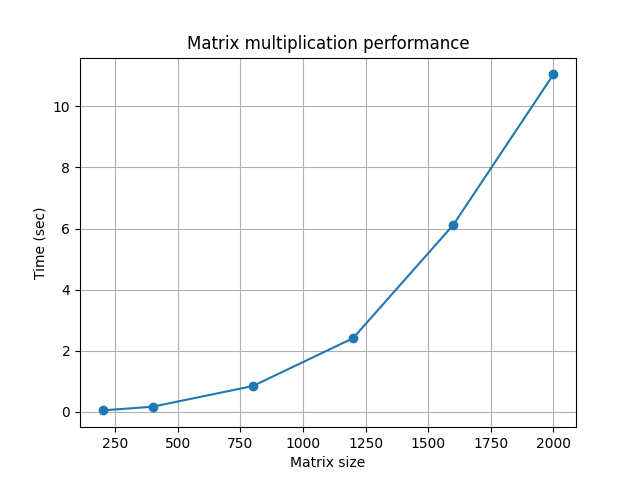

# Лабораторная работа №1  
## Перемножение квадратных матриц

---

## Цель работы

Реализовать алгоритм перемножения квадратных матриц на языке C++  
и провести экспериментальное исследование времени выполнения.

---

## Описание алгоритма

Используется классический алгоритм умножения матриц:

C[i][j] = Σ A[i][k] * B[k][j]

### Сложность алгоритма:
O(n³)

---

## Реализация

- Язык: C++
- Используются вложенные циклы (без сторонних библиотек)
- Ввод: файлы `matrix_a.txt`, `matrix_b.txt`
- Вывод: файл `result.txt`
- Время выполнения измеряется с помощью `chrono`

---

## Проведение экспериментов

Были проведены вычисления для матриц размеров:

200, 400, 800, 1200, 1600, 2000

Для каждого размера измерялось:
- время выполнения
- количество операций (n³)

---

## Результаты

| Размер | Время (сек) | Операции |
|--------|------------|----------|
| 200 | 0.05 | 8e6 |
| 400 | 0.17 | 6.4e7 |
| 800 | 0.85 | 5.12e8 |
| 1200 | 2.41 | 1.7e9 |
| 1600 | 6.11 | 4.1e9 |
| 2000 | 11.04 | 8e9 |

---

## График зависимости времени от размера матрицы

---

## Верификация

Корректность вычислений проверена с использованием Python (NumPy):

- произведение матриц вычисляется в Python
- сравнивается с результатом C++
- используется функция `numpy.array_equal()`

---

##  Выводы

- Время выполнения алгоритма растёт кубически (O(n³))
- При увеличении размера матрицы в 2 раза время увеличивается примерно в 8 раз
- Реализация через вложенные циклы корректна, но неэффективна для очень больших размеров

---

##  Дополнительно

- Реализована автоматическая генерация матриц
- Проведена автоматическая верификация результатов
- Построен график зависимости времени от размера
