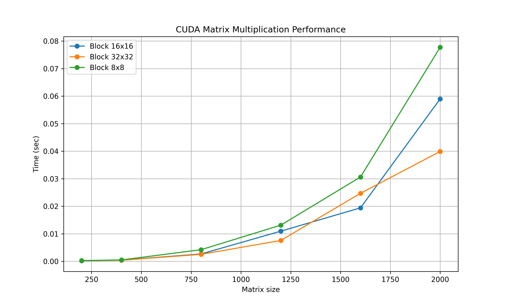

# Лабораторная работа №4. Параллельное перемножение матриц с использованием CUDA
**Выполнила:** Климова Вера, группа 6213

---

## Цель работы
Модифицировать последовательный алгоритм умножения квадратных матриц для параллельного выполнения на графическом процессоре (GPU) с использованием технологии CUDA. Провести экспериментальное исследование зависимости времени выполнения от размера матриц и конфигурации сетки блоков. 

---

## Алгоритм и реализация

### Классическое умножение
$$C[i][j] = \sum_{k=0}^{n-1} A[i][k] \cdot B[k][j]$$

Вычислительная сложность: $O(n^3)$

### Параллелизация (CUDA)
Каждый CUDA-поток вычисляет один элемент результирующей матрицы `C[row][col]`. Потоки организуются в блоки (block) и сетку (grid):

## Реализация
- Язык: C++/CUDA
- Используются CUDA-ядра с массовым параллелизмом потоков GPU
- Ввод: файлы `matrix_a.txt`, `matrix_b.txt`
- Вывод: файл `result.txt`
- Время выполнения измеряется с помощью `chrono` (с синхронизацией GPU через `cudaDeviceSynchronize()`)
- Конфигурация сетки блоков передаётся через аргументы командной строки

---

## Проведение экспериментов

Были проведены вычисления для матриц размеров:

200, 400, 800, 1200, 1600, 2000

Эксперименты повторялись для разных конфигураций блоков CUDA: 8×8, 16×16 и 32×32. Размеры блоков передавались в качестве аргументов при запуске скомпилированной программы, что позволяло быстро тестировать различные параметры параллелизма без перекомпиляции кода.

Для каждой комбинации «размер матрицы — конфигурация блока» измерялось:
- время выполнения (включая копирование данных на GPU и обратно)
- количество операций (n³)

### Время выполнения (секунды) — CUDA

| Размер матрицы | Блок 8×8 | Блок 16×16 | Блок 32×32 |
|:--------------:|---------:|-----------:|-----------:|
| **200**        | 0.00027  | 0.00020    | 0.00025    |
| **400**        | 0.00051  | 0.00044    | 0.00039    |
| **800**        | 0.00422  | 0.00268    | 0.00253    |
| **1200**       | 0.01314  | 0.01095    | 0.00758    |
| **1600**       | 0.03061  | 0.01943    | 0.02470    |
| **2000**       | 0.07772  | 0.05899    | 0.03991    |

## График зависимости времени от размера матрицы

##  Выводы

- GPU даёт колоссальное ускорение.
По сравнению с последовательной CPU-реализацией ускорение достигает 250–300× для матриц размера 2000×2000. Это объясняется массовым параллелизмом GPU: тысячи потоков выполняют вычисления одновременно.
- Конфигурация блока влияет на производительность.
Блок 32×32 в большинстве случаев показывает наилучшее время выполнения. Это связано с архитектурой NVIDIA GPU:
32 потока образуют warp — минимальную единицу планирования.
Такая конфигурация эффективнее использует разделяемую память (shared memory) и регистры. 
Для n=2000 блок 32×32 быстрее 8×8 почти в 2 раза. 
- Время растёт кубически.
При увеличении размера матрицы в 2 раза время выполнения возрастает примерно в 8 раз, что соответствует теоретической сложности. 

Итог: Реализация умножения матриц на CUDA демонстрирует высокую эффективность для задач с высокой вычислительной плотностью. Оптимальная конфигурация блока (32×32) обеспечивает максимальное использование аппаратных ресурсов GPU. По сравнению с технологиями OpenMP и MPI, которые дают ускорение в 1.5–4 раза, CUDA позволяет достичь ускорения в сотни раз, что делает её незаменимой для научных вычислений и машинного обучения.
