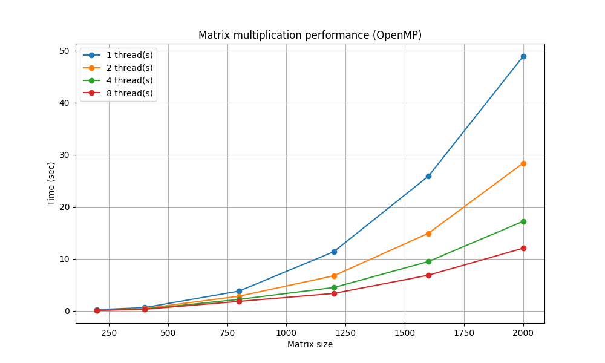

# Лабораторная работа №2. Параллельное перемножение матриц с использованием OpenMP
**Выполнила:** Климова Вера, группа 6213

## Цель работы
Модифицировать последовательный алгоритм перемножения квадратных матриц для параллельного выполнения с использованием технологии OpenMP. Провести серию экспериментов при различном количестве потоков и размерах матриц, оценить ускорение, эффективность и характер загрузки вычислительных ресурсов.

## Описание алгоритма
Используется классический алгоритм умножения матриц.

### Параллелизация (OpenMP)
Распараллеливание выполнено по внешнему циклу (строки результирующей матрицы), так как вычисления для разных строк независимы и не требуют синхронизации записи.

## Реализация

- Язык: C++
- Используются вложенные циклы (без сторонних библиотек)
- Ввод: файлы `matrix_a.txt`, `matrix_b.txt`
- Вывод: файл `result.txt`
- Время выполнения измеряется с помощью `chrono`

## Проведение экспериментов

Были проведены вычисления для матриц размеров:

200, 400, 800, 1200, 1600, 2000

Эксперименты повторялись для разного количества потоков OpenMP: 1, 2, 4 и 8. Количество потоков задавалось через переменную окружения OMP_NUM_THREADS, что позволяло гибко управлять параллелизмом без перекомпиляции программы.

Для каждого размера измерялось:
- время выполнения
- количество операций (n³)

---

### Время выполнения (секунды)

| Размер матрицы | 1 поток | 2 потока | 4 потока | 8 потоков |
|:--------------:|--------:|---------:|---------:|----------:|
| **200**        | 0.22    | 0.09     | 0.11     | 0.08      |
| **400**        | 0.61    | 0.43     | 0.33     | 0.30      |
| **800**        | 3.79    | 2.81     | 2.20     | 1.81      |
| **1200**       | 11.36   | 6.74     | 4.47     | 3.34      |
| **1600**       | 25.89   | 14.91    | 9.48     | 6.85      |
| **2000**       | 48.95   | 28.40    | 17.20    | 12.04     |

## График зависимости времени от размера матрицы

##  Выводы

- Время выполнения растёт пропорционально кубу размера матрицы. При увеличении размера в два раза время увеличивается примерно в 6–8 раз. Это полностью соответствует теоретической оценке O(n³). Небольшие отклонения от идеального множителя 8 связаны с тем, что большие матрицы перестают помещаться в кэш процессора, и программа начинает упираться в скорость оперативной памяти.
- Использование OpenMP позволяет сократить время вычислений. На больших матрицах (2000×2000) при запуске в 8 потоков достигнуто ускорение в 4 раза по сравнению с однопоточным режимом. Это хороший результат для задачи, которая активно использует память.
- Для размера 200×200 ускорение нестабильно: иногда 2 потока работают быстрее, чем 4 или 8. Это объясняется тем, что накладные расходы на создание и синхронизацию потоков становятся сопоставимы со временем самих вычислений. Для маленьких задач однопоточный режим часто оказывается оптимальным.
- Чем больше матрица, тем лучше масштабируется программа. Для n=400 ускорение в 8 потоков составляет около 2×, а для n=2000 — уже более 4×. Потоки работают с максимальной загрузкой.

Модификация программы с использованием OpenMP позволила добиться ускорения до 4 раз на больших матрицах при сохранении корректности результатов. Чем больше объём вычислений, тем эффективнее используется многопоточность.
