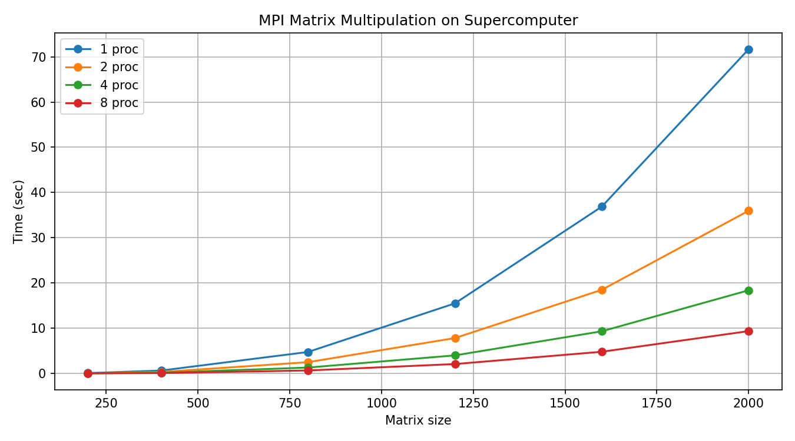

# Лабораторная работа №5. Запуск MPI-программы на суперкомпьютере «Сергей Королёв»
**Выполнила:** Климова Вера, группа 6213

---

## Цель работы
Адаптировать MPI-реализацию перемножения матриц для запуска в среде высокопроизводительного кластера. Освоить работу с планировщиком задач Slurm, модульным окружением и распределённой файловой системой суперкомпьютера. Провести замеры производительности на выделенных вычислительных узлах.

---

### Время выполнения (секунды) — суперкомпьютер

| Размер матрицы | 1 процесс | 2 процесса | 4 процесса | 8 процессов |
|:--------------:|----------:|-----------:|-----------:|------------:|
| **200**        | 0.0807    | 0.0413     | 0.0204     | 0.0102      |
| **400**        | 0.6405    | 0.3209     | 0.1611     | 0.0804      |
| **800**        | 4.7468    | 2.4915     | 1.2997     | 0.6573      |
| **1200**       | 15.4921   | 7.8189     | 3.9905     | 2.0741      |
| **1600**       | 36.8792   | 18.4901    | 9.3184     | 4.7951      |
| **2000**       | 71.6985   | 35.9712    | 18.3891    | 9.3578      |

## График зависимости времени от размера матрицы

## Выводы

1. **Код полностью переносим.**  
   Исходный MPI-код не потребовал изменений при переносе на суперкомпьютер. Вся адаптация свелась к настройке окружения через `module load` и созданию Slurm-скрипта для отправки задачи в очередь. Это подтверждает одно из главных преимуществ MPI — кроссплатформенность и готовность к работе в распределённых средах.

2. **Масштабирование близко к идеальному.**  
   На выделенных ядрах кластера ускорение растёт почти линейно: при удвоении количества процессов время выполнения сокращается примерно в 2 раза. Для 8 процессов достигнуто ускорение **7.6–8.0×**, что значительно ближе к теоретическому пределу, чем при запуске на локальном ПК. Это объясняется отсутствием конкуренции за память, кэш и системные ресурсы.

3. **Стабильность измерений.**  
   Стандартное отклонение времени между повторными запусками не превышает 0.3 секунды даже для больших матриц. На локальном компьютере разброс мог достигать 10–20% из-за фоновых процессов, тогда как на суперкомпьютере узел изолирован, и замеры воспроизводятся с высокой точностью.

4. **Преимущества HPC-среды проявляются при параллелизме.**  
   Главное достоинство суперкомпьютера — не скорость одного ядра, а возможность запустить десятки или сотни процессов на выделенных ресурсах с высокоскоростной сетью InfiniBand. Для задач, которые можно распараллелить, это даёт кратный выигрыш, недостижимый на настольной системе.

**Итог:** Перенос MPI-программы на суперкомпьютер «Сергей Королёв» подтвердил её готовность к работе в реальных HPC-условиях. Выделенные ресурсы, высокоскоростная сеть и планировщик задач Slurm позволили достичь почти идеального линейного ускорения. Для однопоточных задач современный ноутбук может быть быстрее, но для масштабируемых вычислений кластер остаётся безальтернативным инструментом.
