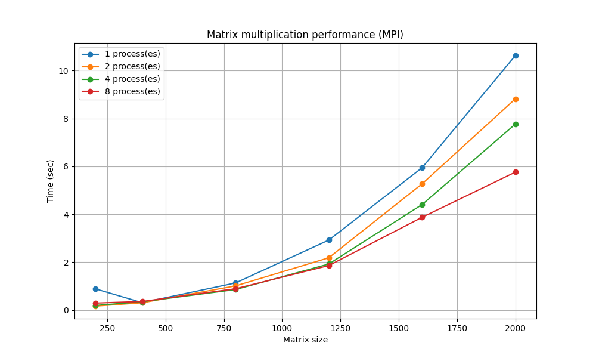

# Лабораторная работа №2. Параллельное перемножение матриц с использованием OpenMP
**Выполнила:** Климова Вера, группа 6213

## Цель работы
Модифицировать последовательный алгоритм перемножения квадратных матриц для параллельного выполнения с использованием технологии передачи сообщений MPI. Провести экспериментальное исследование зависимости времени выполнения и ускорения от количества процессов и размера матриц. Оценить эффективность распараллеливания на одном компьютере и проанализировать накладные расходы, связанные с обменом данными между процессами.

## Описание алгоритма
Используется классический алгоритм умножения матриц.

### Параллелизация (OpenMP)
Распараллеливание выполнено по внешнему циклу (строки результирующей матрицы), так как вычисления для разных строк независимы и не требуют синхронизации записи.

## Реализация

- Язык: C++
- Используются вложенные циклы (без сторонних библиотек)
- Ввод: файлы `matrix_a.txt`, `matrix_b.txt`
- Вывод: файл `result.txt`
- Время выполнения измеряется с помощью `chrono`

## Проведение экспериментов

Были проведены вычисления для матриц размеров:

200, 400, 800, 1200, 1600, 2000

Эксперименты повторялись для разного количества процессов MPI: 1, 2, 4 и 8. Количество процессов задавалось через параметр -n при запуске программы утилитой mpiexec, что позволяло гибко управлять уровнем параллелизма без перекомпиляции кода.

Для каждого размера измерялось:
- время выполнения
- количество операций (n³)

---

### Время выполнения (секунды) — MPI

| Размер матрицы | 1 процесс | 2 процесса | 4 процесса | 8 процессов |
|:--------------:|----------:|-----------:|-----------:|------------:|
| **200**        | 0.89      | 0.17       | 0.19       | 0.29        |
| **400**        | 0.31      | 0.30       | 0.35       | 0.36        |
| **800**        | 1.13      | 1.01       | 0.86       | 0.89        |
| **1200**       | 2.92      | 2.18       | 1.92       | 1.86        |
| **1600**       | 5.95      | 5.27       | 4.41       | 3.88        |
| **2000**       | 10.64     | 8.83       | 7.77       | 5.76        |

## График зависимости времени от размера матрицы

##  Выводы

- Ускорение есть, но оно скромнее, чем в OpenMP.
Максимальное ускорение составило ~1.85× при 8 процессах на матрице 2000×2000. Это меньше, чем в лабе с потоками, потому что процессы в MPI изолированы: каждый имеет свою память, а обмен данными требует времени на копирование и синхронизацию.
- На малых матрицах параллелизм не окупается.
Для размеров 200 и 400 время выполнения почти не меняется или даже растёт при увеличении числа процессов. Накладные расходы на запуск mpiexec, инициализацию среды и передачу данных превышают выгоду от распараллеливания.
- Чем больше задача — тем лучше масштабирование.
При росте размера матрицы вычислительная нагрузка растёт быстрее, чем коммуникационные затраты. Поэтому для n=2000 ускорение становится стабильным и заметным, а для n=200 — хаотичным.
- Однокомпьютерный запуск — не идеальная среда для MPI.
Все процессы конкурируют за одну оперативную память, кэш и ядра процессора. В реальных кластерных системах, где каждый процесс работает на отдельном узле с собственной памятью, эффективность была бы выше.

Реализация умножения матриц на MPI работоспособна и даёт ускорение на больших задачах. Однако для выполнения в пределах одного компьютера потоковая модель (OpenMP) показывает лучшую эффективность из-за меньших накладных расходов. MPI раскрывает свой потенциал при запуске на нескольких физических машинах.
